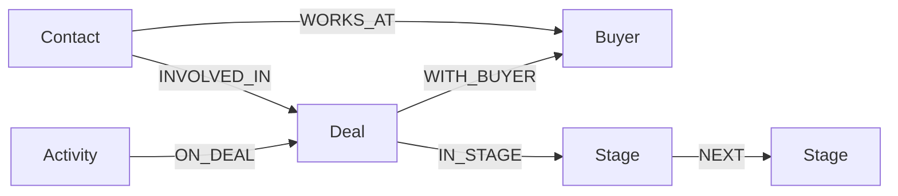

# Knowledge graph schema

## Why a graph at all?

"What's going on with this deal?" is a **relational** question — who talked to
whom, about what, before which stage transition, and how long ago. SQL can answer
it with JOINs, but the agent reasons more naturally by *traversing*: from a deal,
hop to its activity stream, to its stakeholders, to its position in the funnel.
The graph stores the entities a sales rep actually thinks about and the typed
edges between them, so each agent tool is a short, readable traversal rather than
a multi-table JOIN.

This is **not** a 1:1 mirror of the SQL tables. We drop the bookkeeping tables
(`activity_links`, `pipelines`, `deal_contacts` as a node) and fold them into
**typed edges**, dedupe the 18 messy `pipeline_stages` rows into 9 `Stage` nodes,
add **funnel ordering** (`NEXT` edges + `order_index`), and **precompute the
signal properties** the agent queries most (activity counts, first/last activity
timestamps) onto the `Deal` node.

## Multi-tenancy

**One graph key per tenant**, named `crm:{company_id}`. A tenant's subgraph is a
physically separate FalkorDB graph, so a query against tenant A's key cannot reach
tenant B's data — isolation is structural, not a `WHERE company_id = …` clause we
might forget. The `company_id` always comes from the JWT.

## Nodes

| Label      | Key props | Other props |
|------------|-----------|-------------|
| `Deal`     | `id`      | `name`, `stage_label`, `is_closed`, `is_closed_won`, `owner`, `activity_count`, `inbound_count`, `outbound_count`, `first_activity_at`, `last_activity_at`, **`summary`, `sentiment`, `key_topics`, `open_asks`** (LLM-derived — see *Enrichment*) |
| `Buyer`    | `id`      | `name`, `industry` |
| `Contact`  | `id`      | `name`, `email`, `position`, `buyer_id` |
| `Stage`    | `label`   | `order_index` (funnel position; -1 if unknown) |
| `Activity` | `id`      | `type`, `subject`, `direction` (`inbound`/`outbound`/`unknown`), `timestamp` (ISO), `ts` (epoch, for ordering/age), `snippet` (HTML-stripped, truncated body — the evidence text) |

Activity timestamps are stored as both an ISO string (`timestamp`, for display +
evidence) and an epoch float (`ts`, for `ORDER BY` and age math). "Days since"
is computed against real `now()` at query time, so staleness stays correct even
though the snapshot is static.

## Edges

| Edge | Direction | Props | Meaning |
|------|-----------|-------|---------|
| `WITH_BUYER`  | `(Deal)→(Buyer)`     | —                     | the account being sold to |
| `WORKS_AT`    | `(Contact)→(Buyer)`  | —                     | contact employed at buyer |
| `INVOLVED_IN` | `(Contact)→(Deal)`   | `role`, `confidence`  | stakeholder on the deal |
| `IN_STAGE`    | `(Deal)→(Stage)`     | —                     | current funnel position |
| `NEXT`        | `(Stage)→(Stage)`    | —                     | funnel progression order |
| `ON_DEAL`     | `(Activity)→(Deal)`  | `direction`, `ts`     | activity on the deal timeline |

## Diagram

## Enrichment (LLM-derived node attributes)

Beyond the raw CRM fields, each `Deal` node carries attributes derived by an LLM
(Haiku) from its activity timeline:

- `summary` — a short digest of where the deal stands and what the buyer wants.
- `sentiment` — `positive` / `neutral` / `negative` / `at_risk`.
- `key_topics` — the main topics discussed (joined string).
- `open_asks` — concrete buyer requests not yet fulfilled (joined string).

These are generated **once** at seed time and **cached in Postgres**
(`deal_enrichment` table). The graph build *copies* them onto the node, so
`/graph/rebuild` is LLM-free and deterministic; `/graph/enrich` regenerates them.
This is the deliberate **two-database split**: Postgres is the attribute store
(raw + derived) and the transactional CRUD surface; the graph is the
reasoning/traversal surface the agent queries. The agent uses these attributes for
a fast read of a deal's state before drilling into individual activities.

## How the agent reads the graph (dynamic Cypher)

The agent is **not** limited to fixed queries. It has two tools:

- `get_graph_schema()` — returns this schema (labels, properties, edges, example
  queries) so the agent knows the structure.
- `run_cypher(query)` — runs **read-only** Cypher (FalkorDB `GRAPH.RO_QUERY`)
  against *this tenant's* graph and returns the rows.

The agent decides what to retrieve. Safety: `RO_QUERY` refuses writes
server-side, and the query can only ever touch this tenant's graph key (the handle
is derived from the JWT's `company_id`), so cross-tenant access is structurally
impossible. Internal app logic (closed-deal short-circuit, proactive ranking)
still uses a couple of fixed parameterised reads in `queries.py`.

## Known data limits reflected here

- **No activity→contact links** in the source data (all `activity_links` are
  deal-scoped), so activities attach to the `Deal`, not individual contacts.
- **Roles are all `unknown`/`inferred`** in the seed, so `INVOLVED_IN.role` is
  modelled but the agent does not lean on champion/decision-maker coverage.
- **No money signal** (`deal_amount` all 0), so prioritisation excludes deal size.

## Rebuild

`build_graph(company_id)` drops the tenant's graph key and rebuilds it from
Postgres. Idempotent — `POST /graph/rebuild` calls it for the current tenant only.
Writes to the CRM after a build do not sync until the next rebuild.
