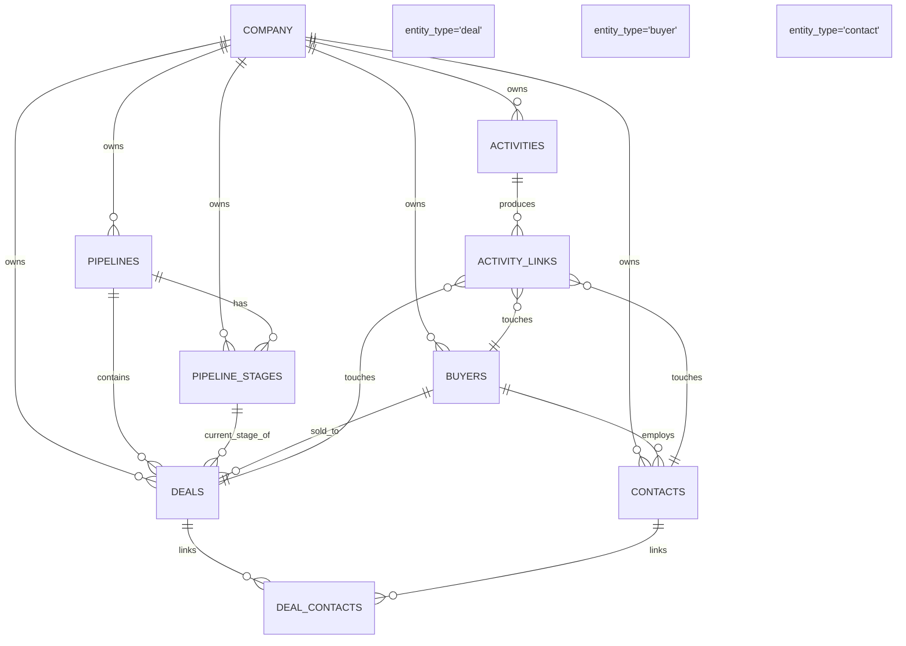

# Data model — the sample CRM

The sample dataset is a **simplified slice of a real HubSpot-connected CRM**. It carries just enough structure to reason about deals: a company, pipelines, buyers, contacts, deals, deal↔contact links, activities, and a polymorphic activity→entity link table.

The data itself is a real extract (anonymised) — expect messy values: empty bodies, NULLs in places you'd want a value, contacts that belong to a buyer but aren't on any deal, etc. That's intentional. Real CRMs are like that.

> **You design the storage.** There is no SQL schema in this repo on purpose. You decide whether to model this in Postgres (an empty one ships in `docker-compose.yml`), in SQLite, or to skip a relational layer and load directly into the graph. Justify the call in your README.

## What ships

A single file: [`db/fixtures.json`](../db/fixtures.json) (~4 MB).

Top-level shape:

```json
{
  "company":         { ... },
  "pipelines":       [ ... ],
  "pipeline_stages": [ ... ],
  "buyers":          [ ... ],
  "contacts":        [ ... ],
  "deals":           [ ... ],
  "deal_contacts":   [ ... ],
  "activities":      [ ... ],
  "activity_links":  [ ... ]
}
```

## Sample size

| Collection         | Items |
|--------------------|------:|
| `company`          |    1 |
| `pipelines`        |    1 |
| `pipeline_stages`  |   18 |
| `buyers`           |   10 |
| `contacts`         |   11 |
| `deals`            |   10 |
| `deal_contacts`    |   11 |
| `activities`       |  305 |
| `activity_links`   |  305 |

All 10 deals were picked as the deals with the **most activity** in the source CRM — so each one has a meaningful timeline you can reason about.

## Entity-relationship diagram



## Entities — what each field means

All `id` fields are UUID strings. All timestamps are ISO 8601 UTC strings (or `null`).

### `company`
The tenant. Only one in this dataset.
```json
{ "id": "...", "name": "Narrio", "created_at": "..." }
```

### `pipelines` / `pipeline_stages`
The sales workflow.
```json
{ "id": "...", "company_id": "...", "label": "Sales Pipeline",
  "object_type": "deal", "display_order": 0, "is_active": true, "created_at": "..." }
```
Stages have a `pipeline_id`, a `label` (e.g. `"Contract Sent"`, `"POC"`, `"Closed Won"`), and a `display_order` (their position in the funnel).

### `buyers`
The companies you're selling to (the "accounts").
```json
{ "id": "...", "company_id": "...",
  "name": "Acme Corp", "description": "...",
  "website_url": "...", "linkedin_url": "...",
  "industry": "...",       // sometimes null
  "created_at": "...", "updated_at": "..." }
```

### `contacts`
People inside a buyer.
```json
{ "id": "...", "company_id": "...", "buyer_id": "...",   // buyer_id can be null
  "name": "...", "first_name": "...", "last_name": "...",
  "email": "...", "phone": "...", "position": "...",
  "linkedin_url": "...",
  "created_at": "...", "updated_at": "..." }
```

### `deals`
The opportunities you're recommending actions on. The interesting fields:

| Field                | Meaning |
|----------------------|---------|
| `pipeline_id`, `pipeline_stage_id` | What pipeline / stage the deal is in. |
| `stage_label`        | Denormalised copy of the stage's label at extract time (so you don't always need a JOIN). |
| `deal_amount`, `currency` | Often `0`/`null` in this sample — don't filter on it. |
| `deal_owner`         | Email of the rep owning the deal. |
| `close_date`         | Expected close date. |
| `is_closed`, `is_closed_won` | Terminal states. |
| `source_created_at`  | When the deal was created in the source CRM. |
| `last_activity_at`   | When the source CRM saw activity last (sometimes `null`). |

### `deal_contacts`
Many-to-many between deals and contacts.
```json
{ "id": "...", "deal_id": "...", "contact_id": "...",
  "role": "champion",        // free-text: champion / decision_maker / blocker / ... or null
  "confidence": "...", "created_at": "..." }
```

### `activities`
The timeline. **Not joined directly to deals** — joined through `activity_links`.

| Field           | Notes |
|-----------------|-------|
| `activity_type` | `EMAIL`, `CALL`, `MEETING`, `NOTE`, `TASK`, `DOCUMENT` — check actual distribution. |
| `subject`       | Short headline. |
| `full_text`     | Can be empty / HTML / very long. |
| `direction`     | `INBOUND` (buyer → us), `OUTBOUND` (us → buyer), or `null`. |
| `source`        | `HUBSPOT` for almost everything here. |
| `timestamp`     | When the activity happened in the source system. |

### `activity_links`
Polymorphic: one activity can touch a deal, a buyer, and a contact in three separate link rows.
```json
{ "id": "...", "activity_id": "...",
  "entity_type": "deal" | "buyer" | "contact",
  "entity_id": "...", "confidence": "...", "created_at": "..." }
```

To get a deal's timeline, follow:
```
deal.id → activity_links where entity_type='deal' AND entity_id=deal.id
       → activity_links.activity_id → activities
```

## Useful poke-around questions to ask the data

(Phrased as SQL because it's compact; do them in code / JSON / Cypher — your call.)

```sql
-- Activities per deal
SELECT d.deal_name, d.stage_label, COUNT(al.id) AS activity_count
FROM deals d
LEFT JOIN activity_links al
       ON al.entity_type = 'deal' AND al.entity_id = d.id
GROUP BY d.id ORDER BY activity_count DESC;

-- Distribution of activity types
SELECT activity_type, direction, COUNT(*) FROM activities GROUP BY 1, 2;

-- Distinct contact roles per deal
SELECT role, COUNT(*) FROM deal_contacts GROUP BY 1 ORDER BY 2 DESC;
```

## Gotchas

1. **`last_activity_at` on deals is sometimes NULL** even when there are activities — don't trust it as your only "how stale" signal. Use `MAX(a.timestamp)` over linked activities instead.
2. **`activities.full_text` can be empty / HTML / very long.** Plan for that.
3. **`activities.direction` is sometimes NULL.** Treat NULL as "unknown."
4. **The same activity can link to a deal *and* its contacts** (one activity → many `activity_links` rows). De-dupe when displaying.
5. **There are 18 `pipeline_stages` rows for 1 pipeline** because the source CRM has duplicate stage labels with different `display_order`s. Use `pipeline_stage_id` for identity, `stage_label` for human display.
6. **`deals.stage_label` is denormalised** — convenient for the agent, but if you care about display_order or stage progression you still need the corresponding `pipeline_stages` row.
7. **Most monetary fields are `0` or `null`** in this sample. Don't filter on `deal_amount > 0` or you'll lose almost everything.
8. **Some `contacts.buyer_id` is `null`.** Handle the orphan case gracefully.
